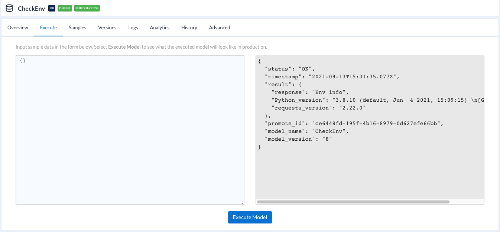

## Upgrade promote-app Python dependencies when deploying a model

### Purpose
ML is growing fast. Promote-app platform was built couple years ago. And Some ML modules require higher/newer version of dependencies. 

In this scenario, sometimes it's needed upgrade the version of dependencies to make ML model working great and avoid conflict.

### Promote-app platform Structure

Promote platform is using Docker images and containers for promote platform components and ML models.

When ML model has been deployed to promote-app platform, a docker image of the model had been built.

```shell
[centos@ip ~]$ docker images
REPOSITORY                                                                         TAG                 IMAGE ID            CREATED             SIZE
ip:5000/ming-checkenv-1-9250ae14-d4ec-4cd6-90ed-d0dd92e8f0bb             latest              65fbb95497e1        19 hours ago        1.68GB
ip:5000/ming-hellomodel-5-a4037e0f-35e5-43ff-8e80-0b0ee194b564           latest              b87de944f586        11 days ago         1.22GB
ip:5000/production-phelloworld1-1-f3e28554-dac4-446e-bcbf-a4e8a243e99d   latest              45763770254d        3 weeks ago         1.22GB
ip:5000/promote-r                                                        security-upgrades   8d4fa27c770d        2 months ago        1.07GB
id.dkr.ecr.us-west-2.amazonaws.com/promote-r                             security-upgrades   8d4fa27c770d        2 months ago        1.07GB
id.dkr.ecr.us-west-2.amazonaws.com/promote-app                           <none>              b577ff5e7888        2 months ago        1.14GB
id.dkr.ecr.us-west-2.amazonaws.com/elasticsearch                         <none>              09fecb67b8c1        2 months ago        1.57GB
id.dkr.ecr.us-west-2.amazonaws.com/promote-python                        security-upgrades   ede7407aa00f        2 months ago        1.22GB
ip:5000/promote-python                                                   security-upgrades   ede7407aa00f        2 months ago        1.22GB
id.dkr.ecr.us-west-2.amazonaws.com/nginx-proxy                           <none>              4e53b2137e0b        2 months ago        40.9MB
id.dkr.ecr.us-west-2.amazonaws.com/logstash                              <none>              d9e70b1c14f7        2 months ago        976MB
id.dkr.ecr.us-west-2.amazonaws.com/logspout-logstash                     <none>              0f585993f3f7        2 months ago        47.3MB
id.dkr.ecr.us-west-2.amazonaws.com/promote-db                            <none>              ef06495ee56f        2 months ago        273MB
id.dkr.ecr.us-west-2.amazonaws.com/docker-events-mon                     <none>              493aaec1e17b        2 months ago        139MB
id.dkr.ecr.us-west-2.amazonaws.com/telegraf                              <none>              cf3da41c555d        2 months ago        42.1MB
id.dkr.ecr.us-west-2.amazonaws.com/influxdb                              <none>              c780f267ae1f        2 months ago        75.1MB
id.dkr.ecr.us-west-2.amazonaws.com/registrator                           <none>              f7810cf0299d        2 months ago        33.3MB
id.dkr.ecr.us-west-2.amazonaws.com/consul                                <none>              3cd49ac1c92a        2 months ago        35.8MB
registry                                                                           <none>              10b45af23ff3        19 months ago       28.5MB
[centos@ip ~]$
```

### Solutions
In general, there are 2 options to upgrade the version dependencies:
* Upgrade promote-app platform with higher/new version
* Upgrade the dependencies when building docker image of ML model 

As promote-app is a complex system, to upgrade promote-app platform will take time for fully testing.

In this document, will upgrade the dependencies when building docker image of ML model 

### Important disclosure:
Promote-app 1.10 was developed and tested base on the following tech env.  
 * Node 8.17.X or 10.24.X
 * Python 3.6.x
   * progressbar2==3.10.1
   * requests==2.11.1
   * requests-toolbelt==0.7.0
   * schema==0.6.5
 * R 3.3.x

**To upgrade its dependencies might cause issues or version conflict, Alteryx will not take any responsibility on it**. _This reference is not be fully tested_, please **_take your own risk_**.


### How to upgrade Python and/or Python modules  
1, When deploying a model, promote-app will look for promote.sh file first. If promote.sh file exists, promote-app will execute it.

To update python (miniconda3) and pip at promote.sh file. Here Python3.8 will be installed:

```shell
curl -L https://repo.anaconda.com/miniconda/Miniconda3-py38_4.10.3-Linux-x86_64.sh > Miniconda.sh
if [ -d /root/miniconda3 ]; then rm -fR /root/miniconda3; fi
bash Miniconda.sh -b -p /root/miniconda3
export PATH=/root/miniconda3/bin:$PATH
pip install --upgrade pip
```

** You may find the appropriate versions of Miniconda [here](https://repo.anaconda.com/miniconda/)

2, Promote platform will install ML model dependencies using requirements.txt file.

In requirements.txt file (must include promote there), put promote at the top, and then the appropriate version of Python modules.
Here the module of requests will be installed with version 2.22 which by default would be version 2.11
```shell
promote==1.10
schema==0.6.5
requests==2.22
```

3, To use an api to show/verify the version deployed, for example:
```python
import sys
import requests
def check_env(data):
    return {'response': 'Env info',
            'Python_version': sys.version,
            'requests_version': requests.__version__}
```

4, This screeshot show the result:
